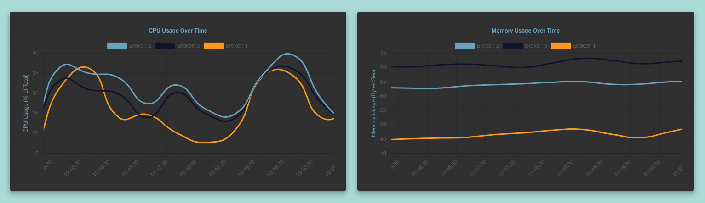
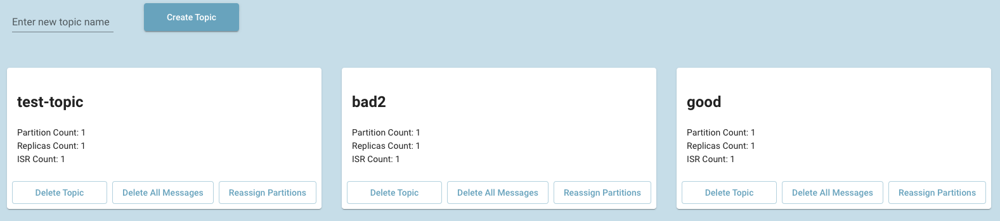
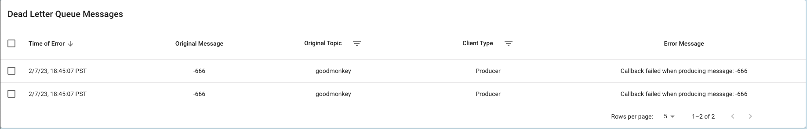
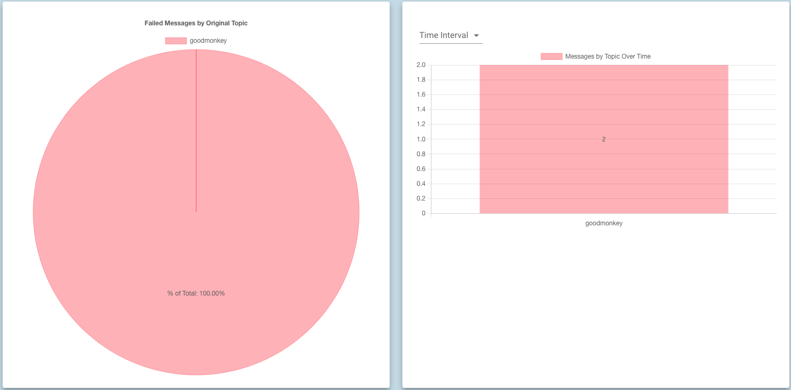

<div align="center">
   <a href="https://https://github.com/oslabs-beta/kafe/">
    
  </a><br><br>

  <p>An open-source Kafka visualizer with Dead Letter Queue support for failed messages. Built for JavaScript developers!<p>
  <a href="https://https://github.com/oslabs-beta/kafe/"></a>
  <a href="https://github.com/oslabs-beta/kafe/stargazers"></a>
  <a href="https://github.com/oslabs-beta/kafe/issues"></a>
  
  
  <a href="http://kafeclient.com"><strong>kafeclient.com</strong></a>
</div>

## Table of Contents

1. [About the Project](#about-the-project)
   - [Built With](#built-with)
1. [Getting Started](#getting-started)
   - [Requirements](#requirements)
   - [Installation](#installation)
1. [Features](#features)
   - [Cluster Tree](#cluster-tree)
   - [Realtime Metrics](#realtime-metrics)
   - [Cluster Manager](#cluster-manager)
   - [Dead Letter Queue Support](#dead-letter-queue-support)
1. [Prometheus Server and Pre-configured Cluster](#prometheus-server-and-pre-configured-cluster)
1. [Roadmap](#roadmap)
1. [Contributors](#contributors)
1. [License](#license)

## About the Project

Kafe is an open-source application to help independent developers to monitor and to manage their Apache Kafka clusters, while offering debugging and failed messages support. With Kafe you can monitor key metrics to your cluster, brokers, and topic performance and take actions accordingly. Through the UI you are able to:

1. Monitor key performance metrics in cluster and brokers with real time charts, and insights of your cluster with info cards.
1. Diagnose and debug your topics with Dead Letter Queue failed messages table and analytic charts.
1. Create and delete topics within a cluster.
1. Reassign partition replicas to support with load balancing and solve for underreplication issues.

### Built With

- [KafkaJS](https://kafka.js.org/)
- [TypeScript](https://www.typescriptlang.org/)
- [Apollo GraphQL](https://www.apollographql.com/)
- [Prometheus](https://prometheus.io/)
- [React](https://reactjs.org/)
- [Chart.js](https://www.chartjs.org/docs/latest/)
- [D3js](https://d3js.org/)
- [Material-UI](https://mui.com/)
- [Jest](https://jestjs.io/)

## Getting Started

### Requirements

Do the following to get set up with Kafe:

- Have node installed. Kafe is built to work on Node 14+.
- If you want to use our pre-configured Kafka cluster, have Docker Desktop and Docker Compose installed and follow the [demo instructions](#prometheus-server-and-pre-configured-cluster).
- Download [JMX exporter](https://github.com/prometheus/jmx_exporter) and add it to your Kafka cluster configurations. You can find the configuration files and a copy of the JMX exporter jar file in the `configs/jmx_exp` folder in this repo. Use the earlier version (jmx_prometheus_javaagent-0.16.1)

  1. If you're starting your Kafka cluster from the CLI you can set up JMX exporter following these commands:
  
  ```
  export KAFKA_OPTS='-javaagent:{PATH_TO_JMX_EXPORTER}/jmx-exporter.jar={PORT}:{PATH_TO_JMX_EXPORTER_KAFKA.yml}/kafka.yml'
  ```
  2. Launch and start your brokers as you normally would.

- Be sure to have a Prometheus metrics server running with the proper targets exposed on your brokers. You can find an example of the Prometheus settings we use for our demo cluster in `configs/prometheus/prometheus.yml`

Refer to the docker-compose files on how to use Docker to launch a pre-configured cluster with proper exposure to Prometheus.

### Installation

1. Clone down this repository:

```
git clone https://github.com/oslabs-beta/Kafe.git
```

2. Create a `.env` file using the template in the `.env.template` file to set the environment variables.
3. In the Kafe root directory to install all dependencies:

```
npm install
```

4. Build your version of Kafe:

```
npm run build
```

## Features

### Cluster Tree
- When you first load Kafe, you can navigate to "home" to see a tree representing your Kafka cluster. It will show the distribution of all your partitions and which brokers they belong to. Each node can be expanded or collapsed for viewing convenience.


### Realtime Metrics
- Kafe provides realtime charts to track important metrics that reflect the health of your Kafka cluster. Metrics that Kafe tracks include but are not limited to:
  1. Overall CPU and Memory usage of your cluster
  1. Time it takes to produce messages
  1. Time it takes for consumers to receive messages from topics they are subscribed to



### Cluster Manager
- Kafe comes with an intuitive and easy-to-use GUI tool to manage your cluster. It should render cards for all active topics and will allow you to create new topics, delete existing topics, reassign replicas of each topic partition and clear all messages for topic.



### Dead Letter Queue
- KafkaJS lacks native support for processing failed messages, so we created a lightweight npm package Kafe-DLQ to handle any failed messages within a Kafka cluster and forward them to a custom 'DeadLetterQueue' topic. Our application then creates a consumer that subscribes to 'DeadLetterQueue', which will then display a dynamic table with information on all messages that have failed since starting the cluster. You can read more about Kafe-DLQ [here](#https://github.com/kafe-DLQ/kafe-DLQ). If you want to utilize Kafe's DLQ features, be sure to do the following:
  1. In your Kafka producer application run:

    ```npm install kafe-dlq```
  
  2. Declare your Kafka cluster configuration. The method is identical to how you would do it with kafkajs:
  
    ```javascript
        const { KafeDLQClient } = require('kafe-dlq');
        const { Kafka } = require('kafkajs');
        
        const kafka = new Kafka({
            clientId: 'dlq-companion',
            brokers: process.env.KAFKA_BROKERS.split(','),
        });
    ```
  3. Create a custom callback to handle specific failure edge cases, initialize a Kafe-DLQ client and instantiate a producer. You can read more about the implementation at the Kafe-DLQ README.

    ```javascript 
        const callback = ((message ) => {
            return parseInt(message) > 0;
        });
        
        //instantiate a DLQ client by passing in KafkaJS client and the callback function
        const client = new KafeDLQClient(kafka, callback);
        const testProducer = client.producer();
    ```

  4. You are ready to start producing messages to your Kafka cluster just like normal, except now any messages that fail will be forwarded to the 'DeadLetterQueue' topic, which Kafe-DLQ will create automatically! Kafe already has a consumer subscribed to this topic, but in a standalone application you would need to spin up the consumer yourself.

    ```javascript
        testProducer.connect()
            .then(() => testProducer.send({
              topic: 'good',
              messages: [{key: '1', value: '1'}, {key: '2', value: '2'}, {key: '3', value: '3'}]
            }))
            .then(() => testProducer.send({
              topic: 'bad',
              messages: [{key: '1', value: '-666'}, {key: '2', value: '-666'}, {key: '3', value: '3'}]
            }))
            .catch((err) => console.log(err));
    ``` 




## Prometheus Server and Pre-configured Cluster
There is an example docker-compose file for spinning up a Prometheus server along with a Kafka cluser: `docker-kafka-prom.yml`.

- If you just need want to spin up a Prometheus server + Kafka Cluster:
  1. We already have a Prometheus config set up, so don't worry about it!
  1. Be sure to change the `KAFKA_BROKERS` environment variable to the ports that you plan on running your cluster on, separated by commas. In our .env.template file it is spinning up three brokers at localhost:9091, localhost:9092 and localhost:9093
  1. Run the following command:

  ```
  docker-compose -f docker-compose-kafka-prom.yml up -d
  ```
## Roadmap

Kafe was just launched in Feb, 2023, and we want to see it grow and evolve through user feedback and continuous iteration. Here are some features we're working on bringing to Kafe in the near future:

- Additional filtering options for topics and to filter data by time
- More flexibility for cluster manipulation such as changing replication factor for a topic, and the option to auto-reprocess failed messages in a topic
- Additional authentication support for Kafka Clusters
- Consumer metrics to monitor consumer performance and make improvements
- Additional frontend testing such as being able to send messages to a topic and testing the response time of the consumer

If you don't see a feature that you're looking for listed above, find any bugs, or have any other suggestions, please feel free to [open an issue](https://github.com/oslabs-beta/kafe/issues) and our team will work with you to get it implemented!

Also if you create a custom implementation of Kafe we'd love to see how you're using it!

## Contributors

- Oliver Zhang | [GitHub](https://github.com/zezang) | [Linkedin](https://www.linkedin.com/in/oliver-zhang91/)
- Yirou Chen | [GitHub](https://github.com/WarmDarkMatter) | [Linkedin](https://www.linkedin.com/in/yirouchen/)
- Jacob Cole| [GitHub](https://github.com/jacobcole34) | [Linkedin](https://www.linkedin.com/in/jacobcole34/)
- Caro Gomez | [GitHub](https://github.com/Caro-Gomez) | [Linkedin](https://www.linkedin.com/in/carolina-llano-g%C3%B3mez/)
- Kpange Kaitibi | [GitHub](https://github.com/KpangeKaitibi) | [Linkedin](https://www.linkedin.com/in/kpange-kaitibi-522b31102/)

## License

This product is licensed under the MIT License without restriction.
